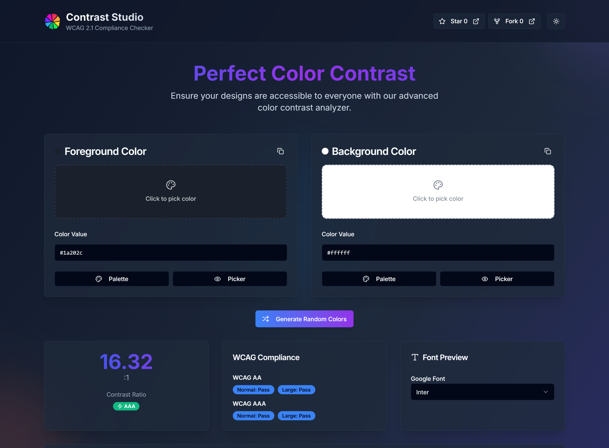

# 🎨 Contrast Checker


A beautiful, responsive, and fully accessible **Color Contrast Checker** built with **Next.js 15**, **Tailwind CSS**, and **shadcn/ui**. Designed to help designers and developers check color contrast ratios for WCAG compliance with live previews, color pickers, and Google Fonts.

👉 **Live Demo**: [color-contrast-checker-six.vercel.app](https://color-contrast-checker-six.vercel.app)  
📦 **My Portfolio**: [swayam-nine.vercel.app](https://swayam-nine.vercel.app/)

---

## ✨ Features

- 🔍 WCAG 2.1 compliance check (AA & AAA, normal and large text)
- 🎨 Foreground and background color pickers
- 🎯 Live contrast ratio preview with pass/fail indicators
- 🌈 Tailwind color palette & HEX, RGB, HSL support
- 🧪 Google Font preview (with dynamic font loading)
- 📱 Fully responsive design with dark mode
- ✅ Accessible UI using semantic elements and ARIA attributes

---

## 📸 Preview



---

## 🚀 Getting Started

### 1. Clone the repository

```bash
git clone https://github.com/swayamDev/contrast-checker.git
cd contrast-checker
```

### 2. Install dependencies

```bash
npm install
```

If you encounter a dependency conflict (e.g. ERESOLVE), run:

```bash
npm install --legacy-peer-deps
```

### 3. Run the App

```bash
npm run dev
```

### 4. Build for Production

```bash
npm run build
```

---

## 🛠️ Tech Stack

- **Framework**: [Next.js 15](https://nextjs.org/)
- **Styling**: [Tailwind CSS 4.0](https://tailwindcss.com/)
- **UI Components**: [shadcn/ui](https://ui.shadcn.com/)
- **Language**: [TypeScript](https://www.typescriptlang.org/)
- **Icons**: [Lucide](https://lucide.dev/) and [React Icons](https://react-icons.github.io/react-icons/)
- **Deployment**: [Vercel](https://vercel.com/)
- **Accessibility**: WCAG 2.1 Compliance, ARIA labels, keyboard support

---

## 🤝 Contributing

Feel free to fork and contribute to improve this tool!

```bash
git checkout -b feature/your-feature
git commit -m "Add your changes"
git push origin feature/your-feature
```

---

## 📄 License

This project is licensed under the [MIT License](LICENSE)
